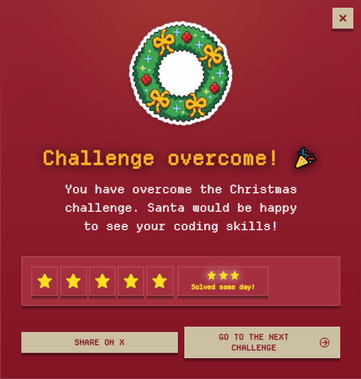

# Challenge 12

Two elves are playing a turn-based battle. Each one has a deck of moves represented as a `string` where each character is an action.

- `A` _**Normal attack:**_ deals 1 point of damage if it’s not blocked
- `B` _**Block:**_ blocks a normal attack (`A`)
- `F` _**Strong attack:**_ deals 2 points of damage, cannot be blocked

Both elves start with **3 hit points**. The first elf to reach **0 hit points or less** loses and the battle ends immediately (no further moves are processed).

**Round rules**

- If both use an attack (`A` or `F`), both take damage according to the type.
- `B` blocks `A`, but **does not block** `F`.
- Everything is resolved **simultaneously**.

**Your task**

Return the result of the battle as a number:

- `1` → if Elf 1 wins
- `2` → if Elf 2 wins
- `0` → if it’s a draw (both reach 0 at the same time or end with the same health)

```js
elfBattle('A', 'B')
// Round 1: A vs B -> Elf 2 blocks
// Result: Elf 1 = 3 HP
//         Elf 2 = 3 HP
// → 0

elfBattle('F', 'B')
// Round 1: F vs B -> Elf 2 takes 2 damage (F cannot be blocked)
// Result: Elf 1 = 3 HP
//         Elf 2 = 1 HP
// → 1

elfBattle('AAB', 'BBA')
// R1: A vs B → Elf 2 blocks
// R2: A vs B → Elf 2 blocks
// R3: B vs A → Elf 1 blocks
// Result: Elf 1 = 3, Elf 2 = 3
// → 0

elfBattle('AFA', 'BBA')
// R1: A vs B → Elf 2 blocks
// R2: F vs B → Elf 2 takes 2 damage (F cannot be blocked)
// R3: A vs A → both -1
// Result: Elf 1 = 2, Elf 2 = 0
// → 1

elfBattle('AFAB', 'BBAF')
// R1: A vs B → Elf 2 blocks
// R2: F vs B → Elf 2 takes 2 damage (F cannot be blocked)
// R3: A vs A → both -1 → Elf 2 reaches 0 Battle ends!
// R4: is not played, since Elf 2 has no health left
// → 1

elfBattle('AA', 'FF')
// R1: A vs F → Elf 1 -2, Elf 2 -1
// R2: A vs F → Elf 1 -2, Elf 2 -1 → Elf 1 reaches -1
// → 2
```

### Solutions

- [Python](./solution.py)
- [JavaScript](./solution.js)
- [TypeScript](./solution.ts)

## Stars earned


